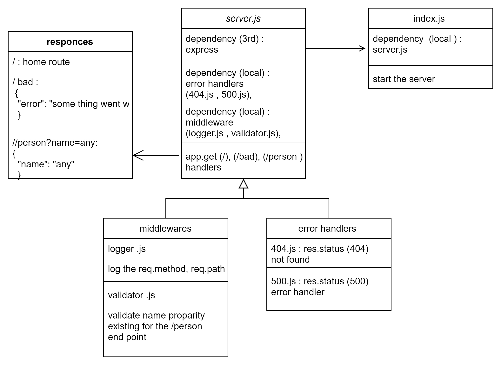

# basic-express-server

this project is a practice prioject for lab 02 of 401 course at asac

- **Author** : hiba salem

- ### description

a Dynamic API server to practice standards compliant Express server

---

- ### NML



[NML](https://app.diagrams.net/#G1SMvHb1PCrpBWPMoXDoaJcEsaH8EGh7c3)

---

- ### [PR]()

---

- ### deploy links

  - [dev branch deployment]()

  - [main deployment]()

  - [tests report]()

---

- ### getting this app

  - clone and npm i --production.
  - npm start or nodemon

---

- ### Setup

  - `.env requirements`
  - `PORT` - Port Number

---

- ### end points

  - `/person?name=any`

    expected responce

  ```
  {
  "name": "any"
  }
  ```

  - `/person?name=`

    expected responce

  ```
  {
  "error": "add a name"
  }
  ```

  - `/person?`

    expected responce

  ```
  {
  "error": "add name proparity"
  }
  ```

  - `/`

    expected responce

  ```
  {
  home route
  }
  ```

  - `/bad`

    expected responce

  ```
  {
  "error": "some thing went wrong"
  }
  ```

---

- ### test this app

  - clone and npm i -D.
  - npm test

---

- ## tests

  - response with 404 on a bad route
  - response with 404 on a bad method
  - response with 500 if no name in the query string
  - response with 200 if the name is in the query string
  - given an name in the query string, the output object is correct
  - force error if name proparity is in not the query
  - response with 200 on a correct request
